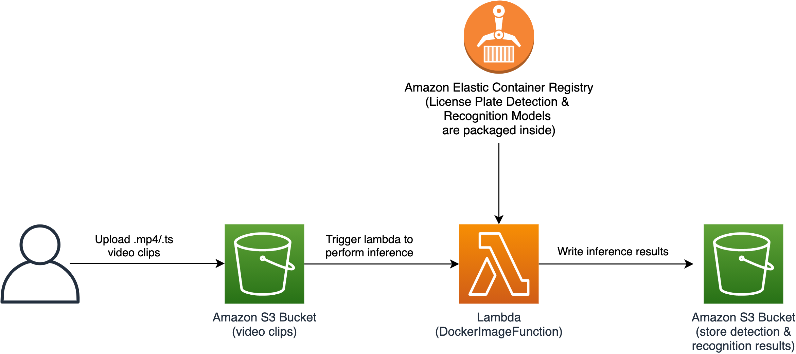

# 基于无服务架构的车牌检测与识别解决方案

## 目录
* [方案介绍](#方案介绍)
* [方案部署](#方案部署)
* [算法实现细节](#算法实现细节)
  * [训练yolov4车牌检测模型](#训练yolov4车牌检测模型)
  * [训练车牌识别模型](#训练车牌识别模型)
* [测试](#测试)
* [许可](#许可)


## 方案介绍
该解决方案基于`Amazon S3`，`Amazon Lambda`，`Amazon Elastic Container Registry (ECR)`，`Amazon DynamoDB`
组件实现。用户基于该解决方案架构可以实现车牌的自动检测和识别，该方案基于无服务架构实现，用户设备侧上传视频片段到
云端S3桶中，会自动触发`Lambda`函数进行车牌检测（检测网络为`yolo-v4`）和识别（识别算法为卷积网络+注意力机制+7个字符分类器），
识别结果会被存储到`DynamoDB`中进行存储。

架构图如下所示:


架构图中各个组件的功能描述如下:
1. `Amazon S3`: 用来存储用户设备端的视频片段；
1. `Amazon Lambda`: 完成视频片段的抽帧，以及对图像帧中的车牌进行检测和识别；
1. `Amazon Elastic Container Registry (ECR)`: 存储着车牌检测和识别处理镜像；
1. `Amazon DynamoDB`: 存储着每一个车牌检测和识别事件的结果。


## 方案部署

整个部署过程包括编译镜像和资源部署，大概需要10-20分钟。

该解决方案支持`aws-cdk`进行部署，部署示例如下：
1. 启动`Amazon EC2`实例，如`us-east-1`区域选择系统镜像`Ubuntu Server 18.04 LTS (HVM), SSD Volume Type - ami-0747bdcabd34c712a (64-bit x86) / ami-08353a25e80beea3e (64-bit Arm)
`，机型选择`t2.large`，添加存储`128 GiB`，启动机器；


2. 通过`ssh`登录至上述实例，安装依赖项，如下所示：
```angular2html
sudo apt-get update
sudo apt-get install -y cmake git zip awscli
sudo apt install nodejs npm
sudo npm install -g n
sudo n stable
PATH="$PATH"
sudo n 16.2.0
sudo npm install -g npm@7.19.0
sudo npm install -g aws-cdk@1.115.0

sudo apt-get install -y apt-transport-https ca-certificates curl gnupg lsb-release
curl -fsSL https://download.docker.com/linux/ubuntu/gpg | sudo gpg --dearmor -o /usr/share/keyrings/docker-archive-keyring.gpg
echo "deb [arch=amd64 signed-by=/usr/share/keyrings/docker-archive-keyring.gpg] https://download.docker.com/linux/ubuntu $(lsb_release -cs) stable" | sudo tee /etc/apt/sources.list.d/docker.list > /dev/null
sudo apt-get update
sudo apt-get install docker-ce docker-ce-cli containerd.io
sudo groupadd docker
sudo usermod -aG docker ${USER}
```
上述命令执行完成之后需要登出（命令行输入`logout`）后再次登入（`ssh`登录至实例）使得`Docker`生效。

3. 用户配置
配置`IAM User`，在命令行输入`aws configure`后，输入`AWS Access Key ID`, `AWS Secret Access Key`，`Default region name`和
`Default output format`，该`IAM User`需要具有创建该解决方案中所有资源的权限（可以为其赋予`AdministratorAccess`权限）。

4. 部署方案
```angular2html
git clone https://github.com/Gaowei-Xu/vehicles-license-plate-detection-and-recognition.git
cd vehicles-license-plate-detection-and-recognition/
npm install
cdk deploy
```


## 算法实现细节
> 主要阐述如何训练Darknet yolov4目标检测模型，及如何将Darknet yolov4模型转化为TensorRT版本，该小节主要是为了
获得目标检测的TensorRT模型，用来将其封装到ECS推理镜像中。

预训练好的车牌检测和车牌识别模型为：

| 任务         |  模型                 |
|--------------|----------------------|
| 车牌检测       |   [detector-tensorflow-2.5.0](https://)   |
| 车牌识别       |   [recognizer-tensorflow-2.5.0](https://)   |


### 训练yolov4车牌检测模型
#### 1. 训练环境准备
在`Darknet`训练完`Yolo-v4`模型之后，我们需要将其转化为通用的`Tensorflow`模型，并进一步将`Tensorflow`模型
转化为TensorRT版本，这些转化过程以及最后的`TensorRT`推理需要依赖于`tensorflow-gpu`，`libnvinfer-dev=7.1.3-1+cuda11.0`等
一系列依赖库的安装，下述命令是基于Amazon EC2 g4dn.xlarge实例（Ubuntu 18.04 OS)的环境准备过程：

```angular2html
sudo apt-get update
sudo apt-get install -y git cmake awscli libopencv-dev python3-pip
python3 -m pip install --upgrade pip

# install tensorflow-gpu (SHOULD BE VERSION 2.4.0), it matches cuda/cudnn/nvinfer7 versions
pip3 install tensorflow-gpu==2.4.0
pip3 install opencv-python==4.5.2.54
pip3 install easydict==1.9

# add NVIDIA package repositories
wget https://developer.download.nvidia.com/compute/cuda/repos/ubuntu1804/x86_64/cuda-ubuntu1804.pin
sudo mv cuda-ubuntu1804.pin /etc/apt/preferences.d/cuda-repository-pin-600
sudo apt-key adv --fetch-keys https://developer.download.nvidia.com/compute/cuda/repos/ubuntu1804/x86_64/7fa2af80.pub
sudo add-apt-repository "deb https://developer.download.nvidia.com/compute/cuda/repos/ubuntu1804/x86_64/ /"
sudo apt-get update

wget http://developer.download.nvidia.com/compute/machine-learning/repos/ubuntu1804/x86_64/nvidia-machine-learning-repo-ubuntu1804_1.0.0-1_amd64.deb
sudo apt install ./nvidia-machine-learning-repo-ubuntu1804_1.0.0-1_amd64.deb
sudo apt-get update

wget https://developer.download.nvidia.com/compute/machine-learning/repos/ubuntu1804/x86_64/libnvinfer7_7.1.3-1+cuda11.0_amd64.deb
sudo apt install -y ./libnvinfer7_7.1.3-1+cuda11.0_amd64.deb
sudo apt-get update

# install development and runtime libraries (~4GB)
sudo apt-get install -y --no-install-recommends cuda-11-0 libcudnn8=8.0.4.30-1+cuda11.0 libcudnn8-dev=8.0.4.30-1+cuda11.0 --allow-downgrades

# reboot and check GPUs are visible using command: nvidia-smi

# install TensorRT, which requires that libcudnn8 is installed above
sudo apt-get install -y --no-install-recommends libnvinfer7=7.1.3-1+cuda11.0 libnvinfer-dev=7.1.3-1+cuda11.0 libnvinfer-plugin7=7.1.3-1+cuda11.0

echo 'export PATH=/usr/local/cuda/bin:$PATH' >> ~/.bashrc 
echo 'export LD_LIBRARY_PATH=/usr/local/cuda/lib64:$LD_LIBRARY_PATH' >> ~/.bashrc
source ~/.bashrc
```


#### 2. `Darknet`编译
安装`Darknet`环境，将`Darknet Yolov4`克隆到本地目录：
```angular2html
git clone https://github.com/AlexeyAB/darknet.git
```
更改编译选项`Makefile`，使其支持`GPU`训练，如下所示：
```angular2html
GPU=1
CUDNN=1
CUDNN_HALF=1
OPENCV=1
AVX=1
OPENMP=1
LIBSO=1
ZED_CAMERA=0
ZED_CAMERA_v2_8=0
```
开始编译`darknet`，命令如下：
```angular2html
cd darknet
make -j4
```
编译成功会生成一个可执行文件，如下所示：
```angular2html
ubuntu@ip-11-0-1-195:~/darknet$ ls -al darknet
-rwxrwxr-x 1 ubuntu ubuntu 6705768 Jul 14 03:56 darknet
```

#### 3. 创建`Darknet`训练配置文件
以宠物检测为例，共有两个检测类别（猫，狗），我们配置目标检测类别为`2`的配置文件：
```angular2html
cd darknet/cfg/
cp yolov4-custom.cfg yolov4-pets.cfg

# 更改配置，输入宽高改为512；max_batches改为10000；steps改为max_batches的0.8，0.9倍；
# classes改为2（不含背景类）；filters=255改为filters=(classes + 5)x3)
vi yolov4-pets.cfg  

cd ../data/
vi pets.names  # 输入第一行cat，第二行dog保存
vi pets.data   # 输入配置选项
cat pets.data 

# cat pets.data输出如下：
# classes = 2
# train  = data/pets/train.txt
# valid  = data/pets/val.txt
# names = data/pets.names
# backup = backup/

# 下载训练数据
aws s3 cp s3://ip-camera-ai-saas/dataset/pets-detect/pets.zip .
unzip pets.zip

# 下载pre-trained模型
cd ../
mkdir models
cd models/
wget -c https://github.com/AlexeyAB/darknet/releases/download/darknet_yolo_v3_optimal/yolov4.conv.137
```

#### 4. 开始车牌检测模型训练
执行如下脚本启动后台训练：
```angular2html
nohup ./darknet detector train data/pets.data cfg/yolov4-pets.cfg models/yolov4.conv.137 -dont_show -mjpeg_port 8090 -map 2>&1 > train.log &
```
   
### 训练车牌识别模型

#### 1. 车牌识别网络设计


#### 2. EC2训练环境准备和数据下载


#### 3. 开始车牌识别模型训练


## 测试
该解决方案默认的部署的机型为`g4dn.xlarge`，配置单个`Nvidia T4 GPU`，由于端到端的访问时耗主要由网络传输延时和服务器端处理时间引起的，为了
客观的得到服务器的并发能力，我们基于图像 [persons.jpg](./source/simulate/test_imgs/persons/persons.jpg) 进行并发测试，它的大小为`546x819x3`，
在服务器端进行推理之前，首先需要将图像`resize`到固定的输入大小(`512x512`)，这个过程耗时与输入原始图像的尺寸紧密相关，越大的图像`resize`的时间越显著。


## 许可
该解决方案遵从MIT-0 许可，更多信息请参阅 LICENSE 文件.
